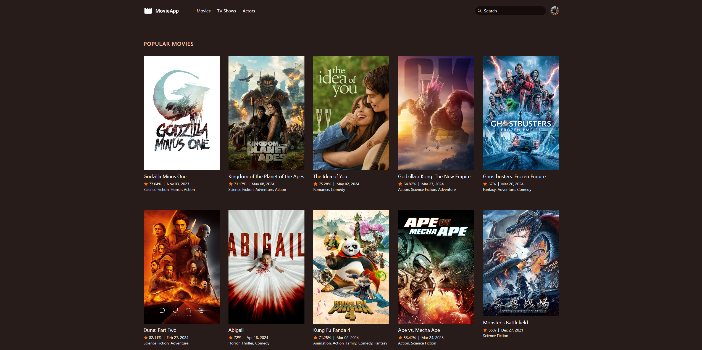
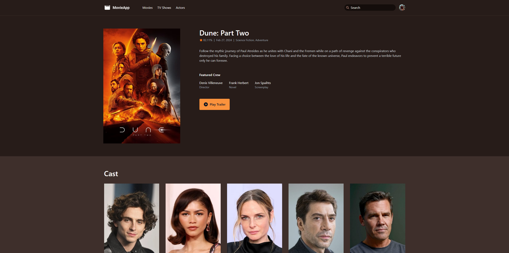
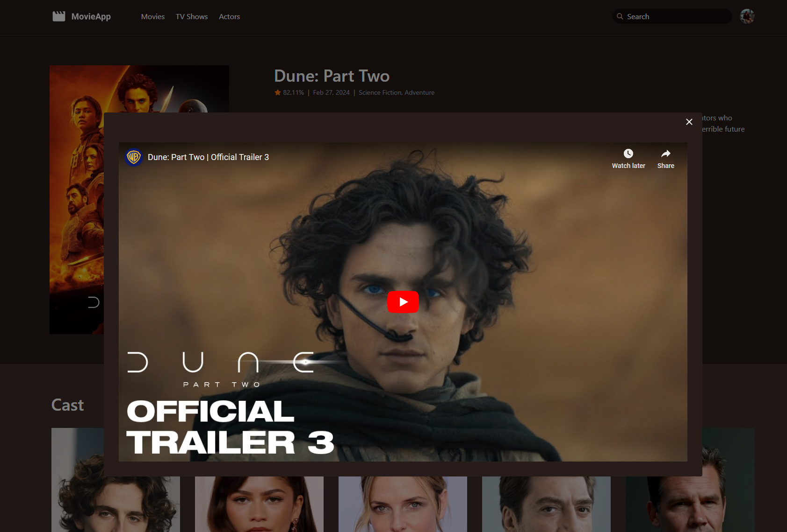
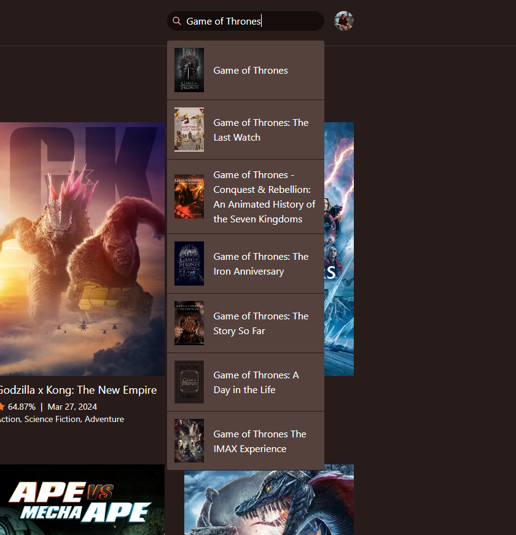

## MovieApp

This application is built in Laravel utilizing [TMDB](https://www.themoviedb.org/?language=en-CA). It displays content about moives such as popular, now playing, and more. It allows access to TV Shows, actors, and search functionaliy for any of these three feature sets. You can view information about movies or TV shows and even view the main trailer via an embedded youtube video.

## Photos

